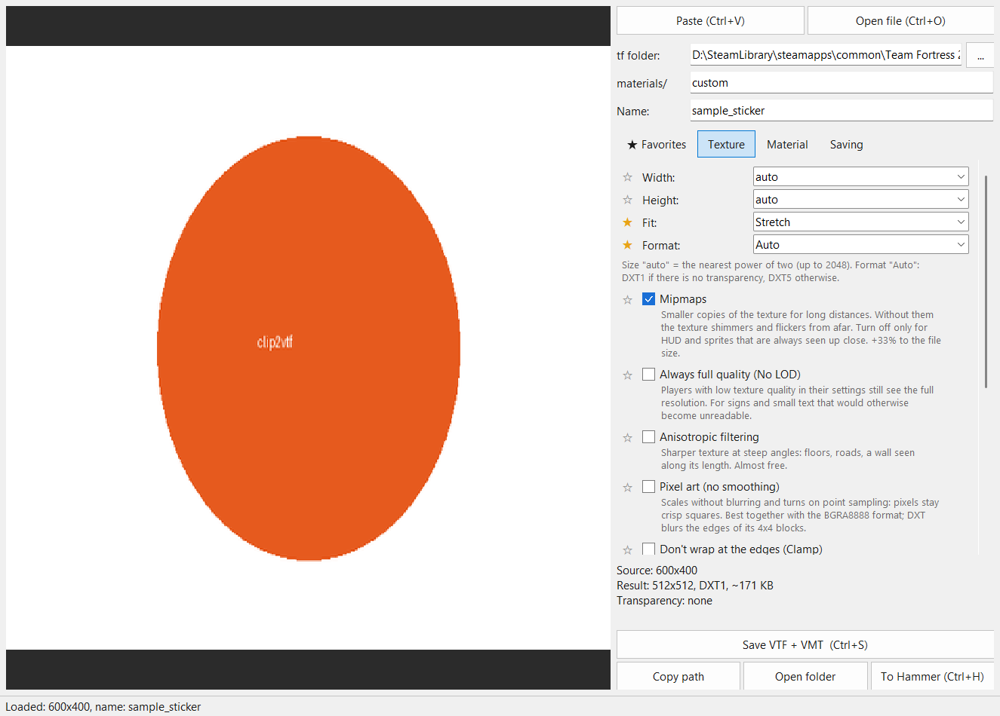
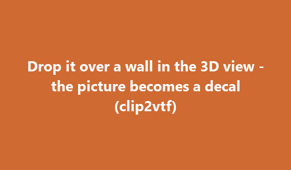
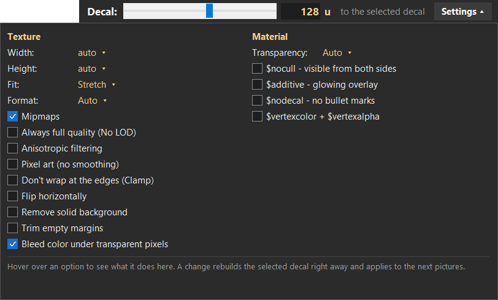

# clip2vtf

**Any picture → TF2 / Source material in one step, and straight onto a wall in Hammer++.**

Copy an image in the browser and press Ctrl+V, or drag it in — clip2vtf writes a correct `.vtf` + `.vmt`.
Drag the picture onto Hammer++ instead, and it lands on the wall you dropped it on: as a decal,
as the texture of that brush face, or as an overlay.

[Русский ниже](#русский) · Interface in 10 languages: English, Русский, Українська, Deutsch, Français,
Español, Português (Brasil), Polski, Türkçe, 简体中文.



## Features

- **Input**: Ctrl+V (screenshot, "Copy image" in a browser, a file copied in Explorer, an image link),
  drag & drop from Explorer or directly from a browser, or drop a file on the exe.
- **Automatic names** from the file name, the image's alt text, the page's search query or its URL —
  hashes and junk words (`images`, `download`, …) are dropped.
- **Correct VTFs**: always version 7.2 (what the TF2 engine reads), power-of-two sizes, computed
  reflectivity (no HDR blow-out), mipmaps, DXT1/DXT5/BGRA8888/BGR888. Every file is **decoded again with
  Valve's own `vtf2tga`** and compared with the picture (PSNR); a bad result turns the status line red.
- **Image options**: remove a solid background, trim empty margins, bleed colour under transparent pixels
  (no halos on mipmaps), pixel-art mode, clamp, flip, fit/stretch/crop.
- **Material options**: shader, `$translucent`/`$alphatest`, `$nocull`, `$additive`, `$nodecal`,
  `$vertexcolor`, decal width in world units (`$decalscale`).
- **Server friendly**: optional `.bz2` for FastDL (stale `.bz2` files are removed), copy to the client `tf`,
  keep the source in `materialsrc/`.

### Hammer++ integration

Drag a picture from the browser onto the Hammer++ window — an orange zone appears over the 3D view.
Drop it on a wall and pick what it becomes (menu **Hammer mode**):

| Mode | What happens |
| --- | --- |
| **Decal** | Apply decals tool + click: an `infodecal` with the size from the settings. The new decal is selected. |
| **Brush texture** | The face under the cursor gets the picture as its texture, optionally stretched over the whole face (Fit). |
| **Overlay** | Apply overlays tool + click: an `info_overlay` you can stretch by its corners. |

After placing, the Selection tool is switched back on, and Ctrl+Z in Hammer undoes it.



When a decal made by clip2vtf is **selected** in Hammer, a panel appears in Hammer's title bar: a size
slider (units) and **Settings ▾** with every texture/material option. A change rebuilds the selected decal
on the spot.



Hammer has no plugin API, so clip2vtf drives it from outside with ordinary Windows messages, exactly
like a user would (it never injects code into Hammer). The windows it opens in Hammer (texture browser,
Object Properties, Face Edit) are kept invisible while it works, so nothing flickers.

## Download

Grab `clip2vtf.exe` from [Releases](../../releases) and run it — no installation. Settings, a log and the
picture sources are stored next to the exe (or in `%APPDATA%\clip2vtf` if that folder is read-only).
The language follows Windows; change it in the **Language** menu.

Requirements: Windows 10/11, Team Fortress 2 installed through Steam (found automatically; its
`bin\vtf2tga.exe` is used for the check). Hammer++ is only needed for the Hammer features.

The exe is not code-signed, so Windows SmartScreen may warn on the first start ("More info" → "Run anyway").

## Run from source

```bat
py -3 -m pip install -r requirements.txt
pyw -3 clip2vtf.pyw
```

Build the single-file exe (`dist\clip2vtf.exe`):

```bat
build.bat
```

`clip2vtf.exe --selftest report.txt` checks a build without opening a window (fast DXT encoder present,
drag & drop library loads, languages found, Valve's decoder reads what was written).

## Translations

UI strings live in [`lang/`](lang) as `{"Russian source text": "translation"}`; `lang/_keys.json` lists every
string the program uses. After editing, run `py -3 check_translations.py` — it reports missing or stale
strings, broken `{placeholders}`, lost line breaks, hotkeys and technical tokens.

## Notes

- If a Hammer++ update changes its dialogs, the Hammer features may stop working; the file
  `clip2vtf_hammer.log` next to the program shows every step. Technical details: [NOTES.md](NOTES.md).
- Tested with the Hammer++ build from September 2026 (64-bit) and TF2.

## License

MIT, see [LICENSE](LICENSE). Bundled third-party components: [THIRD_PARTY.md](THIRD_PARTY.md).

---

## Русский

**Любая картинка → материал TF2 / Source в один шаг, и сразу на стену в Hammer++.**

Скопируй картинку в браузере и нажми Ctrl+V или перетащи её в окно — clip2vtf запишет правильные
`.vtf` + `.vmt`. А если перетащить картинку прямо на Hammer++, она окажется на стене, над которой её
отпустили: декалью, текстурой грани браша или оверлеем (меню **Режим Hammer**).

- Картинка из буфера, из Проводника, прямо из браузера или по ссылке; имя подставляется само.
- VTF всегда версии 7.2, размеры — степени двойки, каждый файл проверяется декодером Valve (vtf2tga).
- Убрать фон, обрезать поля, пиксель-арт, `$nocull`, `$additive`, `$decalscale` и т. д.
- `.bz2` для FastDL, копия в клиентский `tf`, исходник в `materialsrc/`.
- Когда в Hammer выделена декаль из clip2vtf, в заголовке Hammer появляется панель: ползунок размера и
  **Настройки ▾** со всеми галочками — изменения сразу пересобирают выделенную декаль.
- После постановки снова включается Selection, Ctrl+Z в Hammer отменяет.
- Интерфейс на 10 языках, язык меняется в меню **Язык**.

Скачать: `clip2vtf.exe` в [Releases](../../releases), установка не нужна. Нужны Windows 10/11 и TF2 из
Steam (находится сам); Hammer++ — только для функций Hammer. Exe не подписан, поэтому SmartScreen при
первом запуске может предупредить («Подробнее» → «Выполнить в любом случае»).
